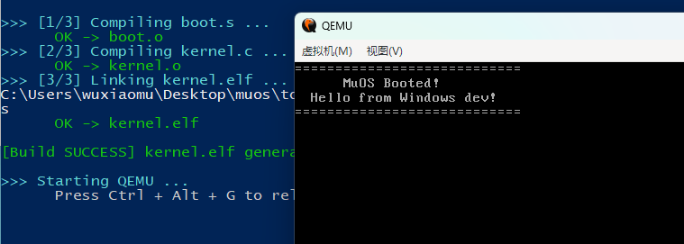

# MuOS

**MuOS** 是一个面向 x86 架构的教学型操作系统内核项目，目标是从零构建一个可运行的最小操作系统。当前阶段实现 **32 位保护模式（i686）** 内核，远期规划迁移至 **64 位长模式（x86_64）**。

开发环境基于 **Windows 原生工具链**，无需依赖 WSL 或 Linux 虚拟机。

---

## 项目架构

```
muos/
├── boot.s            Multiboot1 启动入口（默认，QEMU -kernel 直接加载）
├── boot_grub.s       Multiboot2 启动入口（备用，需 GRUB 引导）
├── kernel.c          内核主程序，VGA 文本模式输出
├── linker.ld         链接脚本，内核加载至物理地址 0x100000
├── grub.cfg          GRUB2 引导菜单配置
├── build.ps1         PowerShell 构建脚本
├── setup-tools.ps1   工具链自动安装脚本
└── tools/            本地工具目录（NASM、QEMU）
```

## 启动流程

```
┌──────────────┐     ┌──────────────┐     ┌───────────────┐     ┌──────────────┐
│  QEMU -kernel│────▶│  boot.s      │────▶│  kernel_main()│────▶│  VGA 显示输出 │
│  (加载 ELF)  │     │  (初始化栈)  │     │  (C 内核入口) │     │  (0xB8000)   │
└──────────────┘     └──────────────┘     └───────────────┘     └──────────────┘
```

默认方案采用 Multiboot1 规范，由 QEMU 直接加载 32 位 ELF 文件，无需 GRUB 介入。`boot_grub.s` 保留供后续制作可启动 ISO 镜像使用。

---

## 开发环境搭建

编译 MuOS 需要以下三类工具：**汇编器**、**交叉编译器**、**虚拟机**。

### 1. NASM（汇编器）

[NASM](https://www.nasm.us/)（Netwide Assembler）是 x86 架构的标准汇编器，用于将 `boot.s` 汇编为 ELF 目标文件。

**安装方式（任选其一）：**

| 方式 | 命令 / 步骤 |
|------|-------------|
| 官方安装包 | 从 [nasm.us](https://www.nasm.us/) 下载 Windows 安装包，安装时勾选 **Add to PATH** |
| Scoop | `scoop install nasm` |
| Chocolatey | `choco install nasm` |
| Winget | `winget install NASM.NASM` |

### 2. i686-elf-gcc（交叉编译器）

这是整个工具链中**最关键**的一环。Windows 自带的 MinGW GCC 生成的是 Windows PE 格式的可执行文件，无法用于裸机（freestanding）环境。必须使用**交叉编译器**，其目标三元组为 `i686-elf`，生成的代码不依赖任何操作系统运行时。

**推荐方案：lordmilko/i686-elf-tools 预编译工具链**

[i686-elf-tools](https://github.com/lordmilko/i686-elf-tools) 由 lordmilko 维护，提供基于 GCC 的 i686-elf 交叉编译器预编译包，适用于 Windows 平台，无需自行从源码构建。

**安装步骤：**

1. 访问 https://github.com/lordmilko/i686-elf-tools/releases
2. 在最新 Release 中下载 `i686-elf-tools-windows.zip`
3. 解压至本地目录，例如 `C:\i686-elf-tools`
4. 将 `C:\i686-elf-tools\bin` 添加到系统 `PATH` 环境变量

该工具链包含以下组件：

| 工具 | 用途 |
|------|------|
| `i686-elf-gcc` | C 编译器（交叉编译，目标 i686-elf） |
| `i686-elf-ld` | 链接器 |
| `i686-elf-as` | GNU 汇编器（备用） |
| `i686-elf-gdb` | 调试器 |

> **注意**：请勿将此工具链与系统自带的 MinGW GCC 混淆。`i686-elf-gcc` 的 `-ffreestanding` 模式不链接标准库，生成的二进制直接在裸机上运行。

**替代方案：MSYS2**

若已安装 [MSYS2](https://www.msys2.org/)，可通过包管理器直接安装：

```bash
pacman -S mingw-w64-i686-elf-gcc
```

### 3. QEMU（系统模拟器）

[QEMU](https://www.qemu.org/)（Quick Emulator）是一个开源的硬件虚拟化/模拟器，本项目使用 `qemu-system-i386` 模拟 x86 32 位 PC 环境来运行和调试内核。

**安装方式（任选其一）：**

| 方式 | 步骤 |
|------|------|
| 官方安装包 | 从 [qemu.org/download](https://www.qemu.org/download/#windows) 下载 Windows 安装包，安装时勾选 **Add to PATH** |
| Scoop | `scoop install qemu` |
| Chocolatey | `choco install qemu` |

### 验证安装

打开 PowerShell，执行以下命令确认各工具已就绪：

```powershell
nasm -v                  # 应显示 NASM 版本号
i686-elf-gcc --version   # 应显示 GCC 版本，目标为 i686-elf
qemu-system-i386 --version  # 应显示 QEMU 版本号
```

---

## 编译与运行

### 方式一：PowerShell 脚本（推荐）

```powershell
.\build.ps1              # 仅编译
.\build.ps1 -Run         # 编译并启动 QEMU
.\build.ps1 -Clean       # 清理构建产物
.\build.ps1 -Grub -Run   # 使用 Multiboot2 方案编译并运行
.\build.ps1 -Grub -Iso -Run  # 制作 ISO 镜像并运行（需 grub-mkrescue）
```

### 方式二：手动编译

```powershell
# 汇编启动代码
nasm -f elf32 boot.s -o boot.o

# 交叉编译 C 内核
i686-elf-gcc -m32 -ffreestanding -O2 -Wall -Wextra -fno-exceptions -fno-stack-protector -c kernel.c -o kernel.o

# 链接为 ELF（加载地址 0x100000）
i686-elf-ld -m elf_i386 -T linker.ld boot.o kernel.o -o kernel.elf -nostdlib

# 在 QEMU 中运行
qemu-system-i386 -kernel kernel.elf
```

启动成功后，QEMU 窗口将显示：



---

## 制作可启动 ISO（可选）

制作 ISO 镜像需要 `grub-mkrescue` 和 `xorriso`，这两个工具在 Windows 上无原生版本，需借助 MSYS2 环境。

### 使用 MSYS2

1. 安装 [MSYS2](https://www.msys2.org/)
2. 在 MSYS2 UCRT64 终端中安装依赖：

```bash
pacman -S grub xorriso
```

3. 将 MSYS2 的 `ucrt64\bin` 目录添加到系统 `PATH`
4. 执行构建脚本：

```powershell
.\build.ps1 -Grub -Iso -Run
```

### 手动制作

```powershell
mkdir -p iso/boot/grub
cp kernel.elf iso/boot/
cp grub.cfg iso/boot/grub/
grub-mkrescue -o muos.iso iso
qemu-system-i386 -cdrom muos.iso
```

---

## 源码说明

### boot.s — 启动入口

采用 Multiboot1 规范（魔数 `0x1BADB002`），QEMU `-kernel` 参数原生支持。CPU 在加载时已处于 32 位保护模式，启动代码完成以下工作：

1. 关中断（`cli`）
2. 初始化栈指针（16 KB 栈空间）
3. 调用 C 语言入口 `kernel_main()`
4. 若内核返回，执行 `cli; hlt` 循环永久停机

### boot_grub.s — GRUB 引导入口（备用）

定义 Multiboot2 头部（魔数 `0xE85250D6`），供 GRUB2 引导加载器使用。需配合 `grub-mkrescue` 生成可启动 ISO。

### kernel.c — 内核主程序

直接操作 VGA 文本模式缓冲区（物理地址 `0xB8000`）。每个字符单元占 2 字节：

```
高字节：属性（前景色 + 背景色）
低字节：ASCII 字符码
```

默认属性 `0x07` 表示黑色背景、浅灰色前景。提供 `clear_screen()`、`putchar()`、`print()` 三个基础输出函数。

### linker.ld — 链接脚本

- `ENTRY(start)` 指定 ELF 入口点为汇编中的 `start` 标签
- `. = 0x100000` 将内核加载到物理地址 1 MB 处，避开实模式中断向量表和 BIOS 数据区

---

## 开发路线图

### 第一阶段：32 位保护模式内核（当前）

- [x] Multiboot1 启动、VGA 文本输出
- [ ] GDT（全局描述符表）初始化
- [ ] IDT（中断描述符表）与 ISR（中断服务例程）
- [ ] 键盘驱动（8042 PS/2 控制器）
- [ ] PIT 定时器（8253 可编程间隔定时器）
- [ ] 物理内存管理（页帧分配器）
- [ ] 虚拟内存（分页机制）
- [ ] 用户模式（Ring 3）切换
- [ ] 简单文件系统（如 FAT12/RAMFS）

### 第二阶段：64 位长模式迁移（远期）

- [ ] 引导阶段启用 PAE 与长模式（Long Mode）
- [ ] 重写 GDT / IDT 为 64 位版本
- [ ] 适配 x86_64 调用约定（System V AMD64 ABI）
- [ ] 64 位内存管理（四级页表）

---

## 常见问题

| 现象 | 原因 | 解决方法 |
|------|------|----------|
| QEMU 报错 `Error loading uncompressed kernel without PVH ELF Note` | 新版 QEMU Windows 版对 Multiboot2 ELF 的 `-kernel` 加载支持存在兼容性问题 | 使用默认的 `boot.s`（Multiboot1）方案，或通过 GRUB ISO 引导 |
| `grub-mkrescue` 找不到 | 该工具无 Windows 原生版本 | 安装 MSYS2 并通过 `pacman -S grub xorriso` 获取 |
| QEMU 黑屏无输出 | Multiboot 头部校验失败或未正确对齐 | 检查 `boot.s` / `boot_grub.s` 中的魔数、校验和及 `align` 指令 |
| 链接报错 `undefined reference to 'start'` | 链接脚本入口标签与汇编源码不一致 | 确认 `linker.ld` 中 `ENTRY(start)` 与汇编中 `global start` 一致 |
| `i686-elf-gcc` 未找到 | 工具链未加入 PATH 或误装为普通 MinGW GCC | 使用 [lordmilko 预编译包](https://github.com/lordmilko/i686-elf-tools/releases)，确认 `bin` 目录已加入 PATH |

---

## 参考文献

- [OSDev Wiki — GCC Cross-Compiler](https://wiki.osdev.org/GCC_Cross-Compiler)
- [OSDev Wiki — Bare Bones](https://wiki.osdev.org/Bare_Bones)
- [Multiboot Specification (Version 1)](https://www.gnu.org/software/grub/manual/multiboot/multiboot.html)
- [Multiboot2 Specification](https://www.gnu.org/software/grub/manual/multiboot2/multiboot.html)
- [OSDev Wiki — VGA Hardware](https://wiki.osdev.org/VGA_Hardware)
- [Intel 64 and IA-32 Architectures Software Developer's Manual](https://www.intel.com/content/www/us/en/developer/articles/technical/intel-sdm.html)

---

## 许可证

本项目采用 [GPL-3.0](LICENSE) 许可证。
